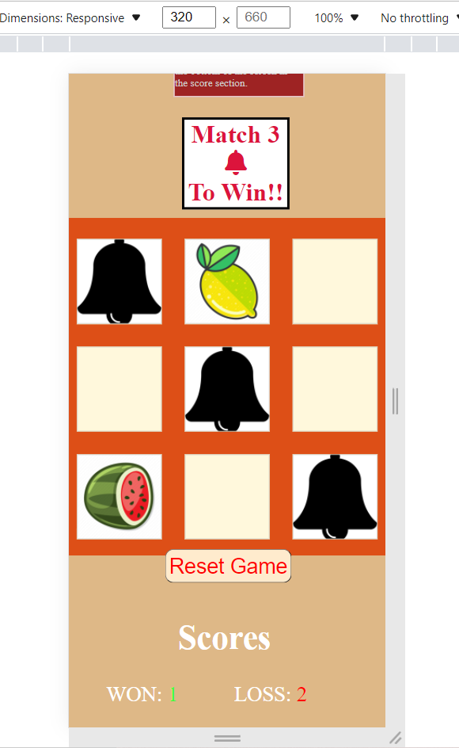

# Match 3 Bells To Win

The purpose of this project is to showcase my javaScript skills and I did that by making my 
'Match 3 to win the game'. This project aims to accomplish a click function for when the user clicks on a div. What happens is that the image is shown and that image is registered to see if that image is a bell icon. Once the user gets 3 bell icons or losses by getting 3 wrong guesses a function is called to calculate the answer and determine if the user gets a win point or a loss point. After the game is finished the user will have a reset button to press
which reset's the images and the player can play again.  

## Features 

* Alert 
 + When a user first loads in, they will see an alert pop-up that will tell the user how to play this game. 

  
***

* The Game Area
 + This section will allow the user to play the Matching Game. The user will be able to click on a square box to 
   display an image.  
   + The user will be able to see how many guesses they have left whenever they click on the square box, an alert will show up and give the user a number between 1/3 depending on how many times they have guessed wrong.
 
   

***

* Reset-button
   + The Reset-button on my page is located right below my game area so that the user knows what the reset button is resetting.

***

* Scores

   + This section will allow the user to see exactly how many wins and losses they have got.
   + The scores section is located underneath the reset button. 
   

*** 

**Features Left to Implement**
 * header + footer + JavaScript
   + If I had more time I would like to style my page a bit more and polish it (make the header nicer).
   + I will add a footer in my spare time to make this look more complete. 
   + I want to add a function where the user will have a pop-up when they win or lose. 

***
    
   ## Testing
   + I have tested all the functions by playing the game once I have implemented a new function, The first function I created was for an EventListener which gets activated once the game is fully loaded and this function sets the other function which is the reset-button function and the getRandomImage function. I have fully tested out they's functions and I know the pros and cons of each function, the problem I still face but plan on fixing is that the user can just keep on clicking on one div and that will count as if the user clicked on different divs (which is not cheating since the principle of the game is still the same, but it's not as intended). Of course, they's problems can be easily fixed with a bit of javaScript knowledge so I'm not too worried about it now but I still plan on fixing they's. I also had an issue with the caluclateAnswer function but I fixed it, the problem was in my switch case, my case 2 wouldn't work but I fixed that problem by executing the code on the default case instead. The calculateAnswer function called the playerHasWon or playerHasLost depending on if the player won or not and I had a lot of trail and errors with they's function but over some time I came across arrow functions which helped me stop the game once the game has finished. I also used arrow functions for my resetGame function and I added some know features to my getRandomImages function.

   + I have confirmed that all my content is easily usable to the user by showing my website to someone else.
   + I have tested my website in different browsers such as Microsft Edge, Chrome, and Firefox.

   **Bugs** 
* UnSolved Bugs
   + The user can just keep on clicking on one div and that will count as if the user clicked on different divs, this is because the div does not save the current choice of a random image so it can't set it.
   *** 
**Validator Testing**
* HTML
   + Getting an Error for my  tags but it is intended to be this way because with the scr and alt attributes the divs don't work properly. 
* CSS 
   + No errors were found.
* JavaScript
   + Getting lost's of  Errors. mostly regarding  (use 'esversion: 6') or Mozilla JS extensions (use moz). 
* Accessibility 
   + I have checked lighthouse, They's are my results.
   
   ***
   ## Development
* My website was deployed on GitHub pages, they's are the steps I took:
   + In GitHub repository, I navigated to settings. 
   + I scrolled down to pages, I clicked on the link. 
   + In the source drop-down menu, I selected my branch as - main, and then I got the link to my website. 
   * Here is the link to my website - https://arminas19.github.io/Project2/ 
 ### Credits 
   **Content** 
   + I Got some help from my mentor and tutors.  
   + I got some help from this youtube tutorial, here is the link - https://www.youtube.com/watch?v=1YjybCS4B2U.
   
**Media**
   + I got my images from Google. here is the link - https://www.bing.com/images/search?q=gambling%20%20icons&qs=n&form=QBIR&sp=-1&pq=gambling%20icons&sc=5-14&cvid=4A9872BAFBCF41259641C7604A5FBECC&first=1&tsc=ImageBasicHover

**Updated Patch**
* Now instead of an Alert with the rules written there, You get a section with the rules so that the user can also remind themself's of how to play the game. 
* I added more specific alert's when it comes to how many lives does the user have.
* I fixed the mobile screen problem by adding a div that surrounds the title so that the title is contained in a smaller section.  
* I removed console.log's from my code
* I updated the image-container divs so that the user can only click the box once. 
* Validated my JavaScript code, now their is only 11 warrnings. 
   + 4 out of the 11 warnings are 'Expected an assignment or function call and instead saw an expression ' warnings.
   + 6 out of the 11 warnings are 'Reassignment of (Function_Here), which is a function. Use 'var' or 'let' to declare bindings that may change', - tried fixing this issue by adding var but that seemed to mess up my code. 
   + The last warning I got was 'Functions declared within loops referencing an outer scoped variable may lead to confusing semantics. (getRandomImage, calculateAnswer)'. 
* Left comment's for my HTML code.
* HTML code validator says there are 18 errors all of them are alt and src attribute errors which are easy to add, but when I do it completely ruins the position of all the divs and since I'm adding a picture later, the src attributes icon appears which is unwanted.  
* Mobile Screen Test 
   + I have checked all screen sizes and found no bugs.
   
* Added Favicon to website.
