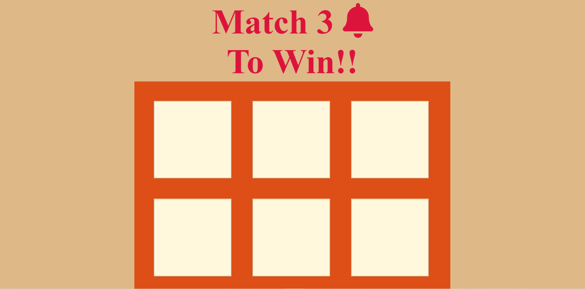
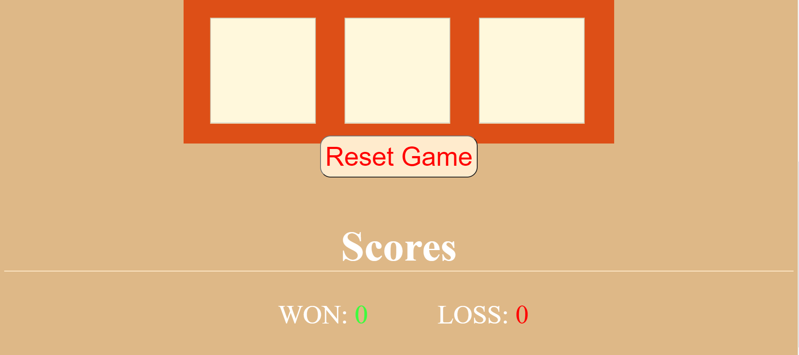
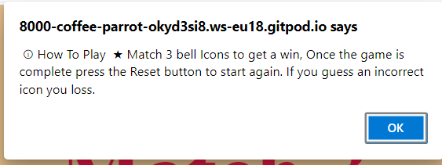
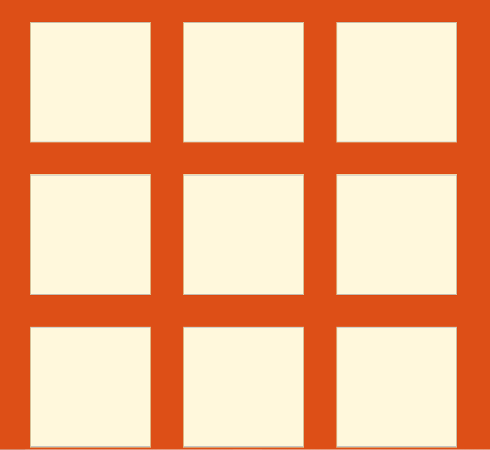
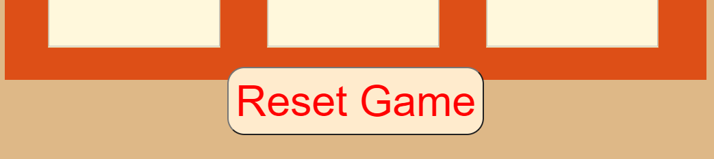
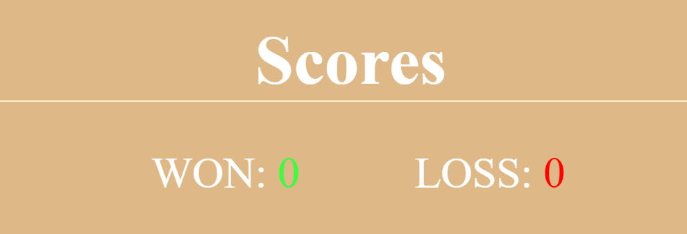
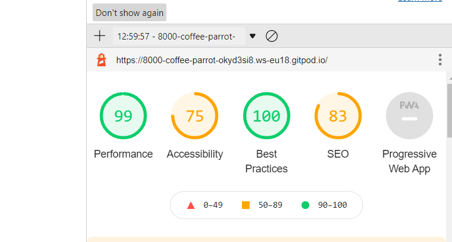

# Match 3 Bells To Win

The purpose of this project is to showcase my javaScript skills and i did that by making my 
'Match 3 to win game'. This project aims to accomplish a click function for when the user clicks on a div. What happens is that 
the image is shown and that image is registered to see if that image is a bell icon. Once the user get's 3 bell 
icons or losses by getting 3 wrong guesses a function is called to calculate the answer and determin 
if the user get's a win point or a loss point. After the game is finished the user will have a reset button to press
which reset's the images and the player can play again. 

## Features 

* Alert 
 + When a user first loads in, they will see a alert pop-up which will tell the user how to play this game. 

  
***

* The Game Area
 + This section will allow the user to play the Matching game. The user will be able to click on a square box to 
   display a image.  
   + The user will be able to see how many guesses they have left whenever they click on the square box, an alert will show up and give the user a number between 1/3 depending on how many times they have guessed wrong.
 
   

***

* Reset-button
   + The Reset-button on my page is located right below my game-area so that the user knows what the reset button is resetting.

***

* Scores

   + This section will allow the user to see exactly how many wins and losses they have got.
   + The scores section is located underneat the reset-button. 
   

*** 

**Features Left to Implement**
 * header + footer + javaScrit
   + If i had more time i would like to style my page a bit more and polish it (make the header nicer) .
   + I will add a footer in my spear time to make this look more complete. 
   + I want to add a function where the user will have a pop-up when they win or loss. 

***
    
   ## Testing
   + I have tested all the functions by playing the game once i have implemented a new function, The first function i created was for an EventListener which gets activated once the game is fully loaded and this function sets of the other function which are the reset-button function and the getRandomImage function. I have fully tested out theys functions and i know the pros and cons of each function, the problem i still face but plan on fixing is that the getRandomFunction randomizes the images but it dose not garintee that all bell icons will load, There is another issue with this function, the user can just keep on clicking on one div and that will count as if the user clicked on different divs (which is not cheating since the princle of the game is still the same, but it's not as intended). Of course theys problems can be easily fixed with a bit of javaScript knowlege so im not too worried about it now but i still plan on fixing theys. I also had an issue with the caluclateAnswer function but i fixed it, the problem was in my switch case, my case 2 wouldnt work but i fixed that problem by excuting the code on the default case instead. The calculateAnswer function called the playerHasWon or playerHasLost depeanding on if the player won or not and i had alot of trail and errors with they's function but over a period of time i came accross arrow functions which helped me stop the game once the game has finished. I also used arrow functions for my resetGame function and i added some know features to my getRandomImages function.

   + I have confirmed that all my content is easily usable to the user by showing my website to someone else.
   + I have tested my website in different browser's such as: Microsft Edge, Chrome and Firefox.

   **Bugs** 
* UnSolved Bugs
   + The getRandomFunction randomizes the images but it dose not garintee that all bell icons will load, thats because the getRandommImages function only randomizes the images but dose not pick a set number before it randomizes the images a thus some images will not in cirtain times you play. 
   + The user can just keep on clicking on one div and that will count as if the user clicked on different divs, this is because the div dose not save the the current choice of a randm image so it can't set it.
   *** 
**Validator Testing**
* HTML
   + Getting an Error for my  tags but it is intended t be this way because with the scr and alt attributes the divs don't work properly. 
* CSS 
   + No errors were found.
* JavaScript
   + Getting lost's of  Errors. mostly regarding  (use 'esversion: 6') or Mozilla JS extensions (use moz). 
* Accessibility 
   + I have checked lighthouse, Theys are my results.
   
   ***
   ## Development
* My website was deployed on GitHub pages, they's are the steps I took:
   + In GitHub repository, I navigated to settings. 
   + I scrolled down to pages, I clicked on the link. 
   + In the source drop-down menu, I selected my branch as - main, and then I got the link to my website. 
   * Here is the link to my website - https://arminas19.github.io/Project2/ 
 ### Credits 
   **Content** 
   + I Got some help from my mentor and tutor's . 
   + I got some help from this youtube tutorial, here is the link - https://www.youtube.com/watch?v=1YjybCS4B2U.
   + i got my images from Google. 
**Media**
   + i got my images from Google. here is the link - https://www.bing.com/images/search?q=gambling%20%20icons&qs=n&form=QBIR&sp=-1&pq=gambling%20icons&sc=5-14&cvid=4A9872BAFBCF41259641C7604A5FBECC&first=1&tsc=ImageBasicHover
